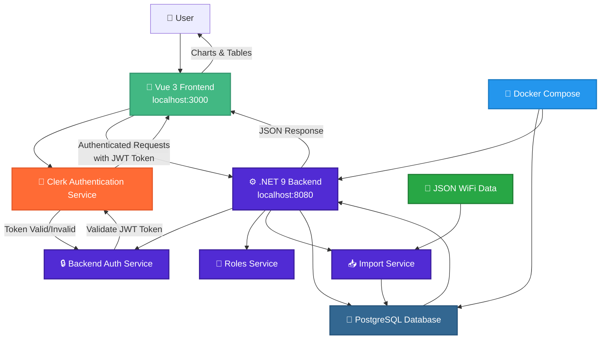

# 🔄 WiFi Exam System Service Interactions

## 🔄 Service Interactions

### 1. **Authentication Flow**

- **Frontend** authenticates users via **Clerk Authentication Service**
- **Clerk** provides JWT tokens for API access
- **Frontend** sends requests with JWT tokens to **Backend**
- **Backend Auth Service** validates JWT tokens by communicating with **Clerk**
- **Clerk** confirms token validity back to **Backend Auth Service**

### 2. **API Communication**

- **Frontend** makes authenticated requests to **Backend API**
- **Backend** serves three main endpoints:
  - Ship IDs, Data Usage, Sales information
- **Roles Service** controls ship-specific access permissions

### 3. **Data Management**

- **Import Service** processes JSON WiFi data files
- **PostgreSQL Database** stores all WiFi usage and sales data
- **Backend** queries database and returns formatted responses

### 4. **Infrastructure**

- **Docker Compose** orchestrates database and backend services
- Services communicate over internal Docker network
- **Frontend** runs independently and connects via HTTP API

## 🔧 Key Service Dependencies

- **Frontend** ↔ **Clerk Authentication** ↔ **Backend Auth Service**
- **Backend Auth Service** ↔ **Clerk** (JWT validation)
- **Backend** ↔ **PostgreSQL Database**
- **JSON Data** → **Import Service** → **Database**
- **Docker** → **Backend + Database** containers
